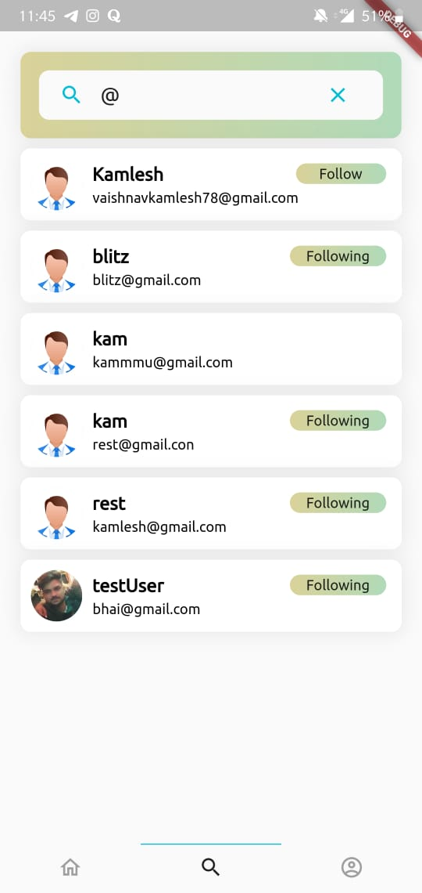
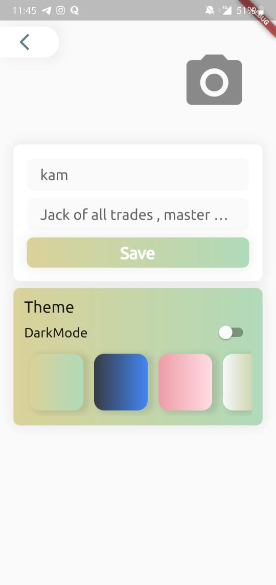
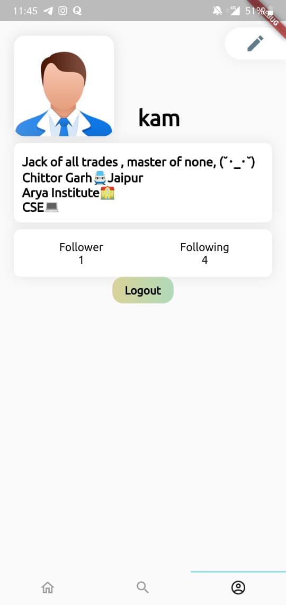
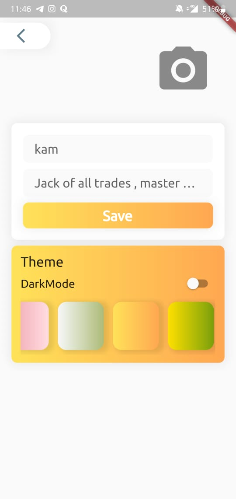
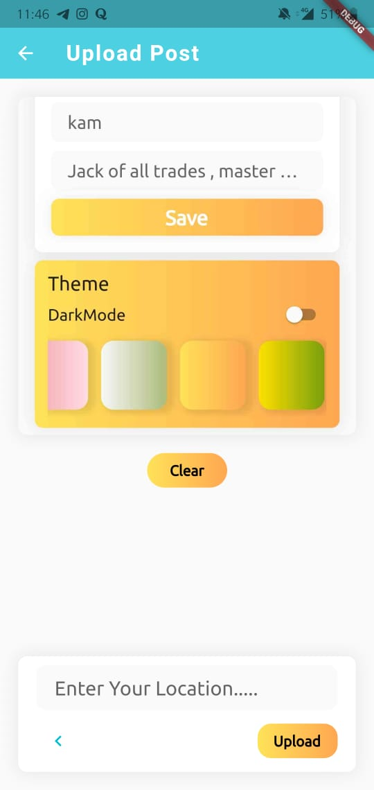
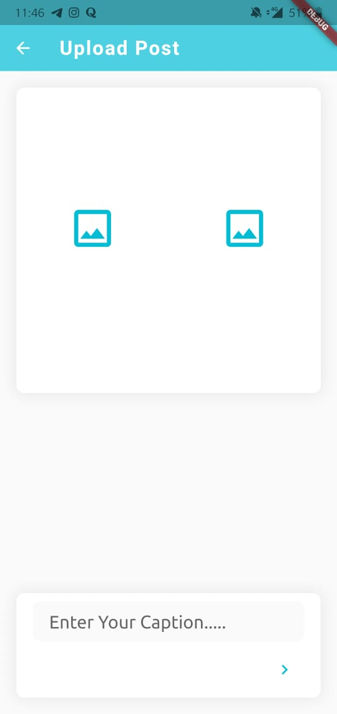
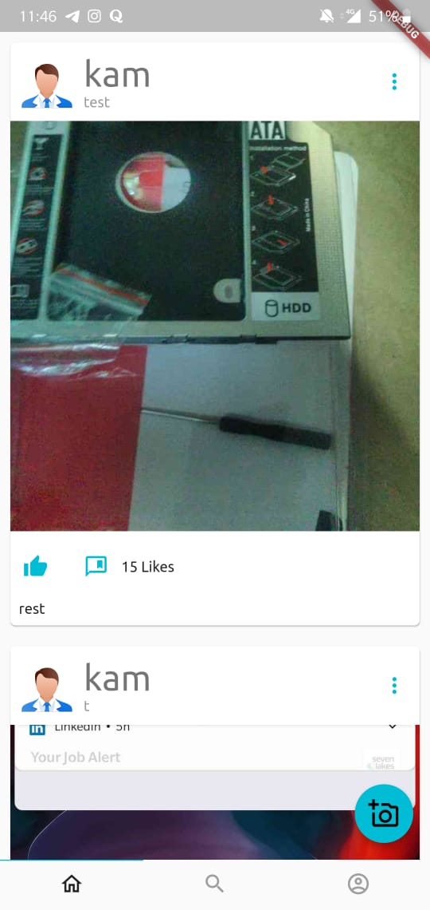

# projectnew

A new Flutter demo project with Clean Architecture and Provider In this project i am following a clean approach in which I seprated all business logics and UI part in two different class. Eg:= View Class=UI implementation; View Model Class=Logics; Change Notifer =state management ;

## Sample Images

## Getting Started

This project is a starting point for a Flutter application.

A few resources to get you started if this is your first Flutter project:

- [Lab: Write your first Flutter app](https://flutter.dev/docs/get-started/codelab)
- [Cookbook: Useful Flutter samples](https://flutter.dev/docs/cookbook)

For help getting started with Flutter, view our
[online documentation](https://flutter.dev/docs), which offers tutorials,
samples, guidance on mobile development, and a full API reference.

